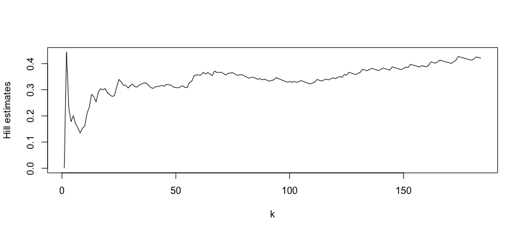

<!-- README.md is generated from README.Rmd. Please edit that file -->

# timeseriesExtremes

<!-- badges: start -->

<!-- badges: end -->

The package timeseriesExtremes aims to compile functions for assesing
the time dependence of
extremes.

## Installation

<!-- You can install the released version of timeseriesExtremes from [CRAN](https://CRAN.R-project.org) with: -->

You can install the package from github using

``` r
devtools::install_github('GBuritica/RPACKAGE/timeseriesExtremes')
```

## Example

Please see below a classical data analysis using the timeseriesExtremes
package.

``` r
library(timeseriesExtremes)
## basic example code
```

The package includes the rainfall data set of weather stations from nine
different locations in France.

``` r
head(rainfall)
#>     y.date BREST LANVEOC QUIMPER BORMES LE.LUC HYERES NANCY METZ ROVILLE SEASON
#> 1 19760101   0.3     0.4     2.1      0      0      0   2.3  4.9     5.0 WINTER
#> 2 19760102   0.1     0.0     0.2      0      0      0   1.4  2.1     9.0 WINTER
#> 3 19760103   0.0     0.1     0.0      0      0      0   1.8  0.8     2.4 WINTER
#> 4 19760104   1.7     1.0     1.4      0      0      0   0.0  0.0     0.0 WINTER
#> 5 19760105   0.0     0.0     0.0      0      0      0   0.7  0.5     0.9 WINTER
#> 6 19760106   0.0     0.0     0.0      0      0      0   0.6  1.3     1.7 WINTER
```

For example, the (tail) index Hill Plot of summer rainfall in Brest is
ploted
below.


